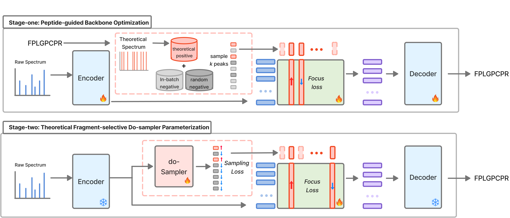

# Do-Novo: Observed Spectrum Driven Do-Sampling of Theoretical Fragments for De Novo Peptide Sequencing in DIA


## Abstract
Motivation: De novo peptide sequencing is an important prerequisite for downstream proteome analysis, enabling the discovery of biomarkers and therapeutic targets. While several deep learning models attempted to improve architectural design to accommodate the multiplexed data independent acquisition (DIA) data, they overlook explicit modeling of intrinsic factors such as fragment missingness and noise interference that arise from the data generation process.

Results: We propose Do-Novo, which learns do-interventions over theoretical fragments for de novo peptide sequencing in DIA mass spectrometry by parameterizing fragment selection to complement raw spectrum decoding. Our key idea is to train a sampler that selectively identifies informative theoretical fragments directly from the observed spectrum in a two-stage training framework. Extensive experiments demonstrate that Do-Novo achieves state-of-the-art performance in de novo peptide sequencing across three DIA benchmark datasets under both feature-based and feature-free settings. Moreover, additional analyses show that Do-Novo generates biologically valid peptide sequences beyond those identifiable by database search. 


## How to run the experiments
### Tested Environment
This project was developed and tested using the following environment configuration
(as specified in `environment.yml`):

- Python: 3.11.13  
- CUDA: 12.6  
- torch: 2.8.0+cu126  
- PyTorch Lightning: 2.5.5  
- pyteomics: 4.7.5  
- pyopenms: 3.3.0  
- depthcharge-ms: 0.4.8  

> **Note**  
> These versions are **not strict requirements**.  
> The project may work with other versions as well, but the above configuration is provided as a reference for reproducibility.
---
### Install environment (Linux)
```
conda env create --file environment.yml
conda activate do_novo_env
```
> **Note**  
> If you encounter issues installing CUDA or PyTorch due to version mismatches, please install PyTorch manually according to your server and CUDA setup.
> See the official PyTorch installation guide: https://pytorch.org/get-started/previous-versions/

---
### Compatibility note for `depthcharge-ms`

Our datasets include additional PTM annotations (e.g., **pyro-Glu**, **C ammonia-loss**) and
require a minor compatibility patch to `depthcharge-ms==0.4.8` for correct ProForma parsing
and peptide detokenization.

Specifically, the following changes are required:

1. **Extend PTM mapping** in `depthcharge/primitives.py` to support additional modifications.
2. **Fix detokenization behavior** in `depthcharge/tokenizers/peptides.py` to ensure correct
   sequence reconstruction.

These changes are necessary to avoid ProForma parsing errors (e.g., `Missing Closing Tag`)
when training or evaluating the model.

#### Option 1 (Recommended): Apply patch automatically
We provide a patch file that can be applied after installing the environment.

Run the following commands **from the Do-Novo repository root**:

```bash
# Locate the site-packages directory where `depthcharge` is installed
SITE_PACKAGES=$(python - << 'EOF'
import depthcharge, inspect, os
print(os.path.dirname(os.path.dirname(inspect.getfile(depthcharge))))
EOF
)

# Apply the patch
git -C "$SITE_PACKAGES" apply "$(pwd)/patches/depthcharge_ms.patch"
```
> The patch is tested with depthcharge-ms==0.4.8.  
> Other versions may require minor adjustments.

To verify that the patch was applied successfully:
```bash
python -c "import depthcharge.primitives as p; print('E-18.011' in p.MSKB_TO_UNIMOD)"
```

#### Option 2: Manual patch
If you prefer to apply the changes manually, please modify the following files
in your Python environment:

- `depthcharge/primitives.py`
  - Extend `MSKB_TO_UNIMOD` with:
    - `"E-18.011": "E[pyro-Glu]"`
    - `"C-17.027": "C[Ammonia-loss]"`

- `depthcharge/tokenizers/peptides.py`
  - Update `PeptideTokenizer.detokenize()` to pass `join=join` to
    `super().detokenize()` and remove the manual string join logic.


---
### Download datasets
If you want to annotated dataset when training our model,
```
pip install gdown
gdown https://drive.google.com/uc?id=1LElJGJ9q9y1Q_iyfvtvre4V10mGDO1Y0 # datasets(oc, uti, plasma)
tar -zxvf data.tar.gz
```

---
### Training models
The easiest way to train a model is specify a config file (eg `configs/train_oc_ump.yaml`) with data, model, and training hyperparameters
```
python main.py --config-name train_oc_ump.yaml
```

---
## Acknowledgement
This code includes modifications based on the code of Cascadia. We are grateful to the authors for providing their code/models as open-source software.

## Contributors

<table>
	<tr>
		<th>Name</th>		
		<th>Affiliation</th>
		<th>Email</th>
	</tr>
	<tr>
		<td>Seungheun Baek&dagger;</td>		
		<td>Data Mining and Information Systems Lab,<br>Korea University, Seoul, South Korea</td>
		<td>sheunbaek@korea.ac.kr</td>
	</tr>
	<tr>
		<td>Yan Ting Chok</td>		
		<td>Data Mining and Information Systems Lab,<br>Korea University, Seoul, South Korea</td>
		<td>yanting1412@korea.ac.kr</td>
	</tr>
	<tr>
		<td>Eunha Lee</td>
        <td>Data Mining and Information Systems Lab,<br>Korea University, Seoul, South Korea</td>
		<td>eunhalee@korea.ac.kr</td>
	</tr>
	<tr>
		<td>Jaewoo Kang*</td>		
		<td>Data Mining and Information Systems Lab,<br>Korea University, Seoul, South Korea</td>
		<td>kangj@korea.ac.kr</td>
	</tr>
</table>

- &dagger;: *First Author*
- &ast;: *Corresponding Author*